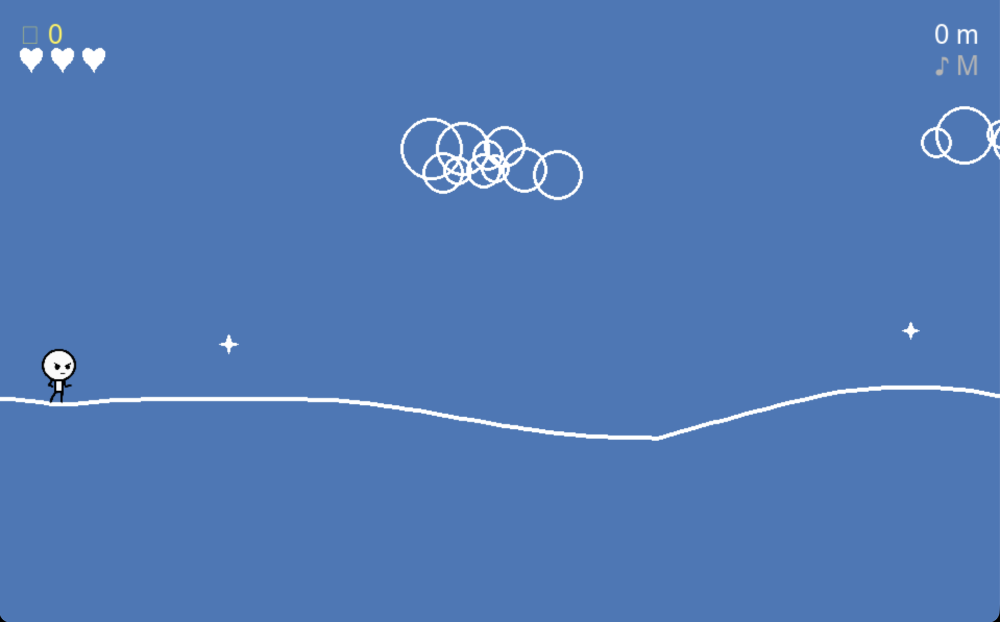

# Walk the Line

A minimalist browser-playable endless platformer where a single chalk line forms the entire world.
Walk the line, jump over gaps and obstacles, and see how far you can go.

This project is an original work and is not affiliated with any existing animated series or characters.

## Screenshot



## Play in the browser

The game is automatically built and deployed to GitHub Pages on every push to `main`:

**➡ https://kristjan-jonsson.github.io/walk-the-line/**

## Controls

| Key | Action |
|---|---|
| `→` / `D` | Walk right |
| `←` / `A` | Walk left |
| `Shift` | Sprint |
| `Space` / `↑` / `W` | Jump |
| `R` | Restart |
| `M` | Mute music |
| `Escape` | Quit (desktop only) |

## Run locally (desktop)

### Using uv (recommended)

[uv](https://docs.astral.sh/uv/) manages the virtual environment automatically:

```bash
uv add pygame
uv run main.py
```

## Build for the web (pygbag)

### Using uv (recommended), use --disable-sound-format-error if error in build

```bash
uv add pygame pygbag
uv run -m pygbag --disable-sound-format-error .
```

Then serve the result with Python's built-in HTTP server:

```bash
uv run -m pygbag --disable-sound-format-error [--width 960 --height 600] .
```

Open http://localhost:8000 in your browser to play.

## GitHub Actions deployment

The workflow at `.github/workflows/pages.yml` automatically:

1. Checks out the code
2. Installs `pygame-ce` and `pygbag`
3. Runs `pygbag --build` to compile the game to WebAssembly
4. Uploads the `build/web/` directory as the Pages artifact
5. Deploys it to GitHub Pages

To enable Pages in your fork: go to **Settings → Pages** and set the source to **GitHub Actions**.

## License

This project is licensed under the Apache License 2.0. See the `LICENSE` file for details.

## Credits
Special thanks to Raphael Concalves (https://rgsdev.itch.io) for the Creative Common 0 Public Domain main character artwork (credit not required).

Music generated by www.freemusic.ai

## Disclaimer

This is an open source project provided "AS IS", without warranty of any kind. See the Apache 2.0 license in `LICENSE` for the full terms and conditions.
